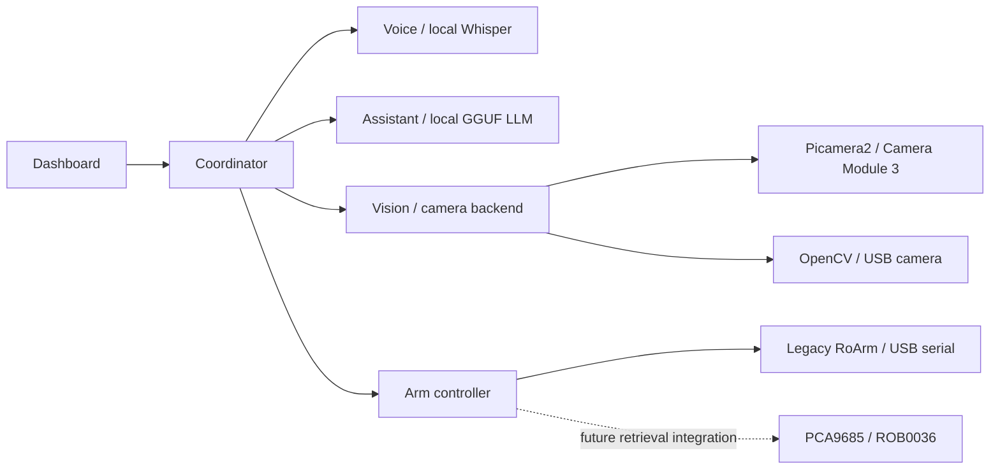

# Architecture

The repository contains six independently runnable applications. Five Python services
use FastAPI and HTTP/JSON; a TypeScript dashboard uses Vite. Each service has its own
package, dependency list, entry point and health endpoint. Python packages are managed
as a uv workspace and JavaScript packages as an npm workspace.

## Hardware direction and current support

The working hardware direction is a Raspberry Pi 5 with a local Camera Module 3 and
PCA9685 HAT driving a DFRobot ROB0036 V2 through the table's separate servo power board.
See the [hardware guide](hardware.md) and [implementation plan](../PLAN.md).

`camera.backend` selects `opencv` or `picamera2`. Camera acquisition stays within vision;
reference matching and API output do not depend on how frames were captured. Hardware
libraries are optional and are loaded only by the selected backend.

`arm.backend` selects `roarm` or `pca9685`. The default runtime profile retains the legacy
RoArm backend; the Pi profile selects Picamera2 and PCA9685 while defaulting to mock mode.
The PCA9685 hardware service reports unavailable and rejects execution and recovery
before opening hardware. Its standalone module provides pulse validation/dry runs and a
low-level output boundary, not an automatic retrieval implementation. No API contract has
been changed to treat commanded pulses as measured positions.

The selected PWM hardware does not report actual joint position. Before integrating it,
we need an explicit design for startup pose, movement completion, stopping and recovery,
using independently validated observations or additional feedback. A delay or successful
I2C write alone cannot establish that the arm reached a target. The existing RoArm
execution behavior described below continues to apply only to that legacy backend.

## Ownership

The browser captures microphone audio and submits WAV to the coordinator, which asks
the voice service to transcribe it. The operator reviews the transcript before submitting
a request. The assistant turns text into a structured intent; it cannot send robot commands.
The coordinator validates tool identity, service readiness/mode, fresh observations, tray
clearance, and arm status before asking the arm controller to execute a reviewed recipe.
The legacy RoArm controller independently validates tool IDs, speed, joint bounds,
initial pose and feedback at each waypoint. Vision then verifies source absence and tray presence.

Only the arm application owns serial or I2C control code. Only the vision application opens
the camera. The voice and assistant applications keep their respective models loaded.
The dashboard owns no workflow state. Common packages contain API models, configuration,
logging and storage utilities, not application logic.

## Interfaces

| Service | Port | Key routes |
| --- | --- | --- |
| Coordinator | 8100 | `POST /requests`, `GET /status`, `GET /operations/{id}`, `GET /events`, `POST /stop`, `POST /recover` |
| Vision | 8101 | `GET /observations`, `GET /preview` |
| Voice | 8102 | `POST /transcribe` (mono 16-bit PCM WAV, 0.1–30 seconds, 8–48 kHz) |
| Assistant | 8103 | `POST /interpret` |
| Arm controller | 8104 | `POST /execute`, `GET /status`, `POST /stop`, `POST /recover` |
| Dashboard | 5173 | Browser UI; `/api/coordinator/*` proxies to the coordinator |

Every Python app also exposes `/health`, `/docs` and `/openapi.json`. The consolidated
OpenAPI document prefixes paths with the service name; these prefixes are contract
namespaces, not paths served directly by each backend. The dashboard proxy exposes only
the coordinator namespace.

Pydantic models in `packages/contracts` are canonical Python types. `npm run contracts`
exports OpenAPI and generates TypeScript types used by the dashboard's typed HTTP client.
Regenerate and commit both generated artifacts whenever API contracts change.
The coordinator validates downstream responses against the same Python models.

## State and failure behavior

Operations progress through `interpreting → checking → moving → verifying → completed`.
Terminal alternatives are `clarification`, `rejected`, `failed`, `stopped`, and `status`.
The coordinator allows one active operation. SQLite stores operation history and recovery
state; the arm has a separate durable journal of submitted operation IDs. Repeating a
coordinator request with the same ID/text returns its existing operation. The arm never
executes an ID twice, even after restart. There are no automatic motion retries.

Journal writes use SQLite WAL with full synchronization on a worker thread. The request
loop can continue serving status during disk I/O, but motion cannot begin until its intent
is committed. Coordinator history and current state are updated in one transaction.

Once dispatch begins, a timeout means the arm may have moved. The coordinator requests a
stop, records failure and blocks further retrieval until an operator acknowledges recovery.
Restarting during an unfinished operation also requires recovery. Legacy RoArm hardware startup
always requires inspection and recovery. Stopping before dispatch prevents dispatch;
stopping during legacy RoArm dispatch waits for that bounded request, then requests a
hold. A PCA9685 backend must define its own validated behavior before retrieval execution.

HTTP logs carry `X-Operation-ID` across the workflow. The dashboard receives state over
server-sent events and refreshes preview frames independently. An API health response
indicates initialization/readiness, not a certified guarantee of hardware availability.
Fresh observations and legacy RoArm serial feedback are checked at execution time; the
PWM backend does not supply equivalent feedback.

## Deployment boundaries

Run exactly one worker per service, on one trusted local computer. SQLite persistence
does not provide distributed locking. The default launcher rejects non-loopback service
addresses and occupied ports. Do not expose these unauthenticated APIs to a network.
Multi-host deployment requires authentication, authorization, transport security, a shared
operation lock, and explicit device ownership before it is supported.

Mock mode substitutes deterministic text interpretation, a fixed transcription, simulated
vision, and simulated motion. A completed mock arm operation updates the mock vision
scene. It does not demonstrate real recognition, transcription or physical manipulation.
Mock mutation endpoints are not registered in hardware mode. The coordinator refuses
retrieval if vision or arm reports a different mode.
