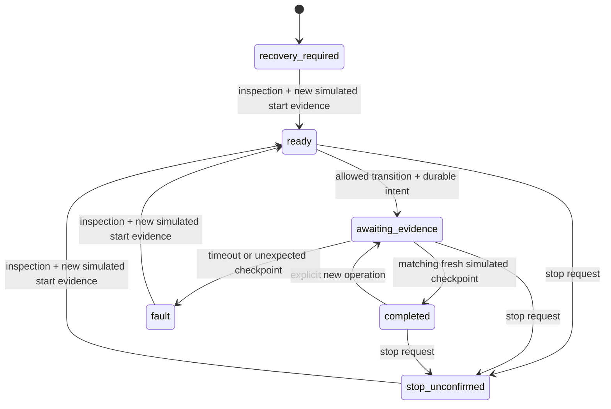

# DFRobot arm control: design and offline rehearsal

**Automated ROB0036/PCA9685 retrieval remains disabled.** This document defines
software decisions we can exercise before assembly, and the evidence still needed
to choose a physical implementation. It does not supply a home pose, joint limits,
payload rating, movement timing, or a physical stop procedure.

## Evidence and ownership

Only the arm application may own output. The coordinator continues to own retrieval,
one active operation, and recovery; assistant, voice, dashboard and vision cannot
send servo commands. Existing public contracts and the legacy RoArm driver are unchanged.

Keep these facts separate:

| Fact | What it establishes | What it cannot establish |
| --- | --- | --- |
| Validated pulse plan | Requested and quantized commands fit supplied pulse bounds | Position, speed, clearance, grip or completion |
| Successful I2C write | The host submitted output settings | That a servo moved or reached a target |
| Elapsed time | A deadline expired | Position or completed movement |
| Camera tool/source/tray classification | Appearance of the configured regions | Joint pose, arm stationarity or a clear trajectory |
| Operator observation | What the operator actually inspected and recorded | Unobserved movement or future autonomous readiness |
| Calibrated measured feedback, if added | Observed quantities within validated accuracy and age limits | Grip, obstacle clearance or load support by itself |
| Rehearsal checkpoint event | A simulated observer supplied a named checkpoint | Any physical result |

Last requested pulses, output-write results and physical observations must have
separate fields and timestamps. A partial write makes output state uncertain; do
not substitute either the previous command or the new command for current position.

## Decisions for the future hardware controller

| Stage | Required behavior | Still needs bench evidence |
| --- | --- | --- |
| Startup | Persist a recovery gate; do not command a midpoint or automatically home. Invalidate observations from earlier sessions. | Output at power-up/reboot; how a supported arm is put in an identifiable starting pose without an uncontrolled transition |
| Readiness | Require reviewed calibration/path revision, current independent start evidence, available control/observation, inspected workspace and acknowledged recovery. Health alone cannot authorize motion. | How the start pose is observed; accuracy, freshness, occlusion and load/clearance criteria |
| Bounded movement | Accept only a reviewed directed transition from its confirmed start; validate all six targets before dispatch; persist intent first. Permit one active transition. | Usable pulse intervals, joint-angle relationships, intermediate path clearance, change size/rate, reach and payload for the installed assembly |
| Completion | Match independent evidence to the active operation, target, calibration revision and session; reject stale/pre-command data. Timeout means unknown outcome and recovery. | Which observable quantities prove each checkpoint; tolerances and sustained evidence criteria; detection of stalls or failure to reach target |
| Stop | Immediately inhibit subsequent commands and latch recovery. Report a request and its evidence separately; unknown physical state stays unknown. | Whether to hold, disable PWM, cut power, or use another physical mechanism; resulting drift/drop, latency and residual travel |
| Fault | Latch faults from lost control, partial writes, stale/lost observations, deadline expiry and unexpected pose. Preserve operation identity and reason. Never retry movement. | Detection and physical response to bus faults, a frozen host, controller reset, brownout and loss of servo power/PWM |
| Recovery | Require operator inspection and new independently confirmed start evidence after the fault/stop. Preserve consumed operation IDs; recovery never replays the interrupted path. | Supporting/unloading and repositioning procedure; re-establishing control without jumping to stale commands |
| Shutdown | Inhibit new work and preserve uncertain operations; release software resources only under the chosen physical procedure. | Effect of normal exit, forced process kill and power removal with the actual load |

Pulse delta limits constrain command changes only. They do not set a servo's speed,
bound actual travel from an unknown pose, or validate the swept volume between
endpoints. The low-level `Pca9685Output` currently requests outputs off on open/close;
that is a development primitive with possible load release, not a commissioned stop.
A hung process can leave prior PWM active. A Python timeout or service manager cannot
provide a hardware watchdog or guarantee a physical stop.

## Open-loop output versus measured feedback

### Option A: PWM output with independent checkpoint observations

Keep servo control open loop, but admit a transition only from a confirmed starting
checkpoint and require independent evidence afterward. Initial commissioning can
record supervised operator observations. Such observations would authorize only the
inspected step, not autonomous retrieval.

For eventual automation, an independently validated observation system would need
to identify the relevant arm checkpoint and stationarity, handle occlusion and
uncertainty, and detect a missed target. The current region classifier cannot do this.
Some joints or dangerous intermediate motion may not be observable from the overhead
view; bench trials must determine whether this option can support any useful
constrained path. Waiting a calibrated duration may schedule a check, but cannot
satisfy it. Visual endpoint confirmation alone does not validate path clearance.

### Option B: add measured feedback

Choose and integrate suitable physical sensing before designing its adapter. Record
which joints/quantities are actually measured, calibration, units, uncertainty,
sample age and failure modes. Commands and feedback must remain independent.
Use measured start checks and sustained in-tolerance samples only after the necessary
thresholds and detection latency have been measured. Partial sensing must not imply
that all six joints are known. Feedback alone still does not prove a grasp, tool
delivery, collision-free path or a reliable stop under loss of control.

**Decision remains open.** Neither option is implemented as a physical completion
source. Do not reuse the RoArm four-angle contract for six PWM servos. Before retrieval
integration, review public status/completion/stop evidence semantics and regenerate
contracts/types together if the selected design changes them.

## Implemented offline state machine

`workbench_arm_controller.rehearsal` is a separate synchronous, single-owner model,
with no device imports, output callback, HTTP route or selectable hardware backend.
It uses the existing SQLite `Store` for atomic intent/status writes and persistent
operation IDs. Use a dedicated `Store("rehearsal", directory)` under
`.runtime/rehearsal/`, separate from the application's durable state.



`fault(reason)` and `stop()` also block every other state. Restart always requires
inspection and new starting evidence; a restart during an active transition records
a fault. No method resumes an operation. Every accepted operation ID remains consumed
after recovery, plan changes, completion or restart.

Terminal operation records retain their completion evidence or original fault/stop
reason. A later stop or stale-start fault updates controller status without overwriting
the earlier operation's result. Reviewed plan collections reject in-place edits; create
a new plan and rehearsal session when changing poses, transitions or command bounds.

### Model inputs and lifecycle

1. Construct `RehearsalPlan(calibration, poses, transitions, max_delta_us,
   evidence_timeout_seconds=..., observation_max_age_seconds=...)`. All values
   are explicit: six-joint pulse calibration, named pulse poses, allowed directed
   pose pairs and per-joint command-change bounds. The plan reuses `PulsePlan` and
   checks the changes after tick quantization. Timing values are simulation policy,
   not measured physical limits. No usable numerical defaults are supplied.
2. Construct `RehearsalController(plan, store, clock=...)`. The default clock is
   monotonic; tests supply a deterministic clock. `snapshot()` returns a session ID,
   plan hash, state and explicit `mode: simulation`, `hardware_ready: false`,
   `measured_feedback: false` fields.
3. Supply `SimulationObservation(session_id, pose_id, captured_at, stationary=True)`
   from the simulated observer, using the same clock and a capture time after session
   startup. Call `recover(observation, acknowledged=True)` to model inspection.
4. Call `request(new_operation_id, target_pose)`. It returns simulated pulse commands
   only after intent/status commit. No device write occurs. It requires a fresh start
   checkpoint and an allowed directed edge; stale starting evidence latches a fault.
5. Advance the fake clock without inventing an observation; `poll()` remains waiting
   or faults at the deadline. It never completes a move. Tests/callers must invoke
   `poll()` to evaluate timeouts; this model has no background watchdog.
6. Only `observe(SimulationObservation(..., operation_id=new_operation_id))` can
   complete the step. Evidence must be stationary, post-command, fresh, nonfuture,
   from this session and operation, and match the requested checkpoint. The result
   is labeled `completion_evidence.kind: simulated_checkpoint`. Rejected malformed
   or stale evidence leaves the model waiting until valid evidence or timeout;
   a valid observation of an unexpected checkpoint latches a fault.
7. `stop()` inhibits commands with `stop_unconfirmed`; it supplies no hold/off command
   or physical-stop evidence. Recovery needs acknowledgement and a new simulated
   stationary checkpoint captured after the block. It cannot reuse a consumed ID.

The test fixtures contain deliberately synthetic pulse values and checkpoint names.
They must not be copied into a physical calibration. This is a decision simulation,
not a kinematic, dynamic, collision, speed or payload simulator. Test it without
camera, I2C or serial libraries:

```sh
uv run --no-sync pytest tests/integration/test_rehearsal.py -q
```

Tests cover startup gating, command bounds, persist-before-command, busy state,
separate completion evidence, stale/future/pre-command/wrong-session data, timeout,
unexpected checkpoints, unconfirmed stop, recovery and SQLite reopen without replay.

## Commissioning evidence still required

Use the [commissioning records](commissioning.md) to preserve measured assignments,
limits, reviewed poses, observations and [acceptance trials](../tests/acceptance/README.md).
Before any hardware retrieval integration, establish all of the following on the
installed assembly:

- Six channel assignments, signal timing and integrity under load; usable joint
  pulse intervals and direction/angle mapping as needed by the chosen design.
- Supported startup and recovery procedure; identifiable starting poses and fully
  reviewed transitions; tool reach, grip and payload at the intended geometry.
- Independent completion/stationarity evidence, its uncertainty and age limits,
  and behavior on missing, stale, occluded or contradictory observations.
- Physical stop and loss-of-control behavior, including host freeze, partial bus
  write, controller reset, signal loss, power interruption and restart. Record
  residual movement, holding/release behavior and required manual intervention.
- Supervised successful/failure trials, including the 27/30 delivery target with
  zero wrong-tool deliveries. Software simulation cannot contribute to that count.

No record-completeness check, rehearsal result, flag or Pi service health check can
remove the existing PCA9685 hardware refusal.
