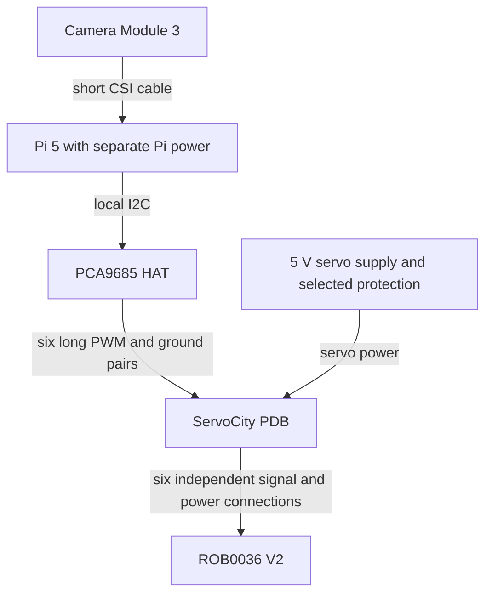

# Hardware setup and calibration

## Selected hardware: DFRobot ROB0036 V2

Working design recorded on 2026-09-15 from the
[owner's hardware discussion](https://chatgpt.com/share/6aa98384-fd30-83ea-8fb3-44aea27ad569?ogimg=plain).
Favor a modest budget, minimal soldering and ready-made connections; prefer DFRobot
parts where they fit. These selections have not been physically qualified together.

| Location | Selected component | Still to establish |
| --- | --- | --- |
| Overhead | Raspberry Pi 5; [DFRobot KIT-003](https://www.dfrobot.com/kit-003.html) | Exact kit contents, RAM, power adapter, case and cooling fit |
| Overhead | 7-inch display | Model, interface, power and HAT/camera cable clearance |
| Overhead | Raspberry Pi Camera Module 3 | Standard versus wide lens; final mounting height and focus |
| Overhead | Waveshare PCA9685 Servo Driver HAT, regular SKU 15275 | Pi 5 mechanical fit, I2C settings and output behavior on the actual board |
| Camera to Pi | Official Standard–Mini camera cable, approximately 300 mm | 15-pin camera end to 22-pin Pi 5 end; actual routing and orientation |
| Table | DFRobot ROB0036 V2 arm | Six channel assignments, assembled-joint limits, reach and usable payload |
| Table | ServoCity 3108-2827-0801 eight-channel power distribution board (PDB) | Connector polarity, protection and measured load |
| Power enclosure | Mean Well LRS-100-5, 5 V / 18 A / 90 W | Enclosure, ventilation, wiring and accessible cutoff |
| Overhead to table | Six approximately 4–6-foot PWM/ground pairs | Mating contacts, routing and signal quality under motor load |

Sources: [DFRobot arm](https://wiki.dfrobot.com/rob0036/),
[Waveshare HAT](https://www.waveshare.com/servo-driver-hat.htm),
[Pi camera cable](https://www.raspberrypi.com/products/camera-cable/),
[ServoCity PDB](https://www.servocity.com/8-channel-servo-power-node/),
[Mean Well specifications](https://www.meanwell.com/Upload/PDF/LRS-100/LRS-100-SPEC.PDF).
A microphone remains necessary if browser voice input is part of the finished bench.

### Arm specifications

| Property | Manufacturer specification |
| --- | --- |
| Actuators | Six TD-8125MG PWM servos |
| Base servo travel | 270 degrees |
| Other five servos | 180 degrees each |
| Command pulse width | 500–2500 microseconds; midpoint 1500 microseconds |
| Nominal supply | 5 V |
| Current per servo | Typical no-load 210 mA; stall 2.6 A typical, 3.4 A maximum |
| Servo stall torque | 23.5–26.8 kg-cm; this is not a payload rating |

Source: [DFRobot specifications](https://wiki.dfrobot.com/rob0036/).
Published servo travel does not establish safe assembled-joint limits or a home pose.
The main specification lists 4.4–8.4 V, while the
[reference page](https://wiki.dfrobot.com/rob0036/docs/18978) lists 4.8–8.4 V.
Both specify 5 V nominal. Resolve the discrepancy for the actual unit before choosing
another voltage. The selected controller and power supply are separate from the arm.

### Wiring and power boundaries



Connect each HAT signal and ground to the corresponding PDB channel. **Leave the
positive conductor disconnected between HAT and PDB.** The PDB's positive contacts
share one power rail; connecting that rail to the HAT would defeat this power separation.
Keep **every PDB signal-sharing switch OFF** so joints receive independent commands.
Ground is shared for signal reference; this is not galvanic isolation.
[ServoCity wiring description](https://www.servocity.com/8-channel-servo-power-node/).

The PDB is rated at **15 A continuous and 30 A peak**. The selected supply is **18 A**;
its rating does not protect the board at 15 A. Six published typical stall currents add
to 15.6 A, and six maximum values add to 20.4 A. Those sums describe a potential overload,
not a measured operating load. Select wiring, connectors and overcurrent protection
around the actual path and load before motor operation. A solderless breadboard may be
useful for low-current experiments; do not route the arm's servo power through it.
[ServoCity ratings](https://www.servocity.com/8-channel-servo-power-node/),
[DFRobot current specifications](https://wiki.dfrobot.com/rob0036/).

The LRS-100-5 lists short-circuit, overload and overvoltage protection, but **does not
specify overtemperature shutdown**. Its overload mode cycles and recovers automatically;
that is neither a controlled arm stop nor a 15 A limit for the PDB. The proposed printed
box is an enclosure concept, not an approved mains assembly. Final construction must
address covered mains terminals, protective earth, strain relief and ventilation according
to the supply's installation requirements. A separate, accessible physical cutoff and
supported-arm testing remain necessary.
[Mean Well specifications](https://www.meanwell.com/Upload/PDF/LRS-100/LRS-100-SPEC.PDF).

Verify the actual contacts and polarity before buying the long harness: retailer
"male-to-male servo cable" labels can describe housings or contacts inconsistently.
Confirm stable PWM at the table during real motor loading. A wire-gauge choice by itself
does not establish reliable signaling over 4–6 feet. Keep camera CSI wiring short and
local to the overhead Pi.

### Software status and calibration

The Pi profile is `config/development/pi.json`: `camera.backend` selects `picamera2`,
and `arm.backend` selects `pca9685`. It still defaults to mock mode. In hardware mode,
the PCA9685 arm service reports unavailable and rejects execution and recovery without
opening I2C. Automated retrieval is deliberately pending a validated motion design.

The low-level `workbench_arm_controller.pca9685` module prepares six-channel PWM output.
Its dry-run command reads a calibration and pose and prints the resulting pulse settings
without accessing hardware:

```sh
uv run --no-sync python -m workbench_arm_controller.pca9685 \
  --calibration path/to/pwm-calibration.json --pose path/to/pose.json
```

Start from `config/workbench/pwm-calibration.example.json`. The template contains
`calibrated: false` and an empty `channels` object; it cannot enable output. A completed
calibration requires exactly six joint labels, each with a distinct `channel` plus measured
`min_us` and `max_us` pulse limits, and `calibrated: true` only after those values have been
established for the actual assembly. The pose maps every label to a requested pulse in
microseconds. There are no default channel assignments or known-safe poses. The optional
`pwm` dependency provides SMBus2 for later hardware development; installing it does not
enable application retrieval.

The [PCA9685](https://www.nxp.com/docs/en/data-sheet/PCA9685.pdf) generates PWM and provides
no measured servo-position feedback. The existing
`apps/arm-controller/src/workbench_arm_controller/driver.py` uses RoArm JSON commands and
four measured fields: `base`, `shoulder`, `elbow`, and `hand`. Its motion completion and
feedback-based hold cannot be reused for this six-servo arm. Last-commanded pulse values
must never be reported as measured position or proof of movement. A process failure may
leave prior PWM outputs active; loss of PWM or power may release the arm. Startup,
completion, stop and recovery need physical validation before integration, as described
in the [implementation plan](../PLAN.md).

### Camera Module 3 smoke check on the Pi

Use a current Raspberry Pi OS with its matching system Python and distribution-managed
Picamera2/libcamera packages. For example, install `python3-picamera2` through the OS
package manager, then create a project virtual environment with access to system packages:

```sh
sudo apt install python3-picamera2
uv venv --python /usr/bin/python3 --system-site-packages
uv sync --extra vision
```

Do this in the Pi checkout; the system camera bindings must match that Python interpreter.
Picamera2/libcamera are not ordinary cross-platform pip dependencies.
[Raspberry Pi camera software documentation](https://www.raspberrypi.com/documentation/computers/camera_software.html).

With motor power disconnected, first confirm the camera using the OS camera tools.
Mount it rigidly, then save a raw frame without starting the vision service:

```sh
uv run --no-sync python -m workbench_vision.setup capture \
  --config config/development/pi.json --output .runtime/camera-setup/first-frame.png
```

Inspect the PNG for color, framing and focus. The setup command opens the **real camera**
even though the Pi profile defaults to mock mode. It needs no reference images and does
not start or import the arm runtime. It discards five warm-up frames by default;
`--discard-frames` accepts 0–60. This is not a guarantee of stable focus or lighting.
Use a new output filename for each capture; existing images are never overwritten.

`camera.device` is the Picamera2 camera index in this backend; OpenCV remains available
for USB cameras via `camera.backend: "opencv"`. Continue with the
[reference collection workflow](#vision-reference-calibration) before starting the
vision service. Camera capture support alone does not qualify localization, physical
motion or the Pi's ability to run all local models together.

## Previous RoArm-M2-S shopping budget

Target an existing GPU computer plus at most $500 in new hardware:

| Item | Allowance |
| --- | ---: |
| Waveshare RoArm-M2-S, suitable power supply and mounting | $300 |
| Logitech C270 USB camera with microphone | $30 |
| Fixed camera mount, lighting, tool holders, tray, gripper padding and accessible cutoff | $70 |
| Shipping, tax, cables and contingency | $100 |

These are budget allowances, not a validated checkout quote. Confirm kit contents,
dimensions, supply requirements, payload at actual reach, and gripper opening before
ordering. Start with three lightweight tools. A full-size wrench has not been qualified.
Sources: [arm options](https://www.waveshare.com/product/roarm-m2-s.htm),
[camera](https://www.logitech.com/en-us/shop/p/c270-hd-webcam).

## Local models and legacy adapter dependencies

Install only the optional adapters you need. These four extras cover vision, the legacy
RoArm serial adapter, voice and the assistant:

```sh
uv sync --extra vision --extra arm --extra voice --extra assistant
```

`llama-cpp-python` may require a native toolchain and a GPU-specific build; the default
installation can use CPU inference. Place a compatible chat/instruction GGUF file at
`models/assistant.gguf` and a faster-whisper/CTranslate2 model directory at
`models/whisper/`. Models are not bundled or downloaded by the applications. Obtain
models with appropriate licenses before offline use. Configure `llm.gpu_layers`,
`llm.context_size`, `speech.device`, and `speech.compute_type` for the actual machine.
The shipped settings use CPU inference so they do not assume a GPU backend or VRAM size.
Measure combined model memory use and latency before enabling GPU offload.

The workspace constrains NumPy below 2.4 for the development host's older Phenom II CPU.
NumPy 2.4 raises its [CPU baseline to x86-64-v2](https://numpy.org/doc/2.4/reference/simd/build-options.html),
which this host does not support. Keep this constraint when using the same machine.

Initialize the ignored `config/workbench/local.json` with the setup command below, and
create a local runtime settings file if changing camera, serial or model options. Set
`WORKBENCH_CALIBRATION` and `WORKBENCH_CONFIG` to absolute paths. No physical setup is
enabled by default. The legacy RoArm adapter refuses motion while `arm.calibrated` is
false; the PCA9685 service remains unavailable independently of that flag.

## Vision reference calibration

Prepare the camera and references with the standalone CLI before starting the vision
service. This allows frame and region inspection while references are still incomplete.
Install the `vision` extra and, on the Pi, use the system-package environment above.
Keep motor power disconnected during camera setup.

### 1. Create the local configuration and inspect regions

Fix the camera mount, resolution, lighting and focus. Copy the bench configuration once:

```sh
uv run --no-sync python -m workbench_vision.setup init \
  --output config/workbench/local.json
uv run --no-sync python -m workbench_vision.setup capture \
  --config config/development/pi.json --output .runtime/camera-setup/empty-bench.png
uv run --no-sync python -m workbench_vision.setup overlay \
  --bench config/workbench/local.json --image .runtime/camera-setup/empty-bench.png \
  --output .runtime/camera-setup/regions-initial.png
```

`init` defaults to `config/workbench/default.json`; use `--source PATH` to choose another
bench file. It refuses to replace an existing local configuration. If one already exists,
continue with that file. Image-producing commands also refuse existing output files.

Inspect the raw `empty-bench.png` and the annotated `regions-initial.png` separately.
Set the four regions using pixel coordinates `[x, y, width, height]`: one for each tool
source and one for the tray. The following box is only an example; replace it with the
measured box for the installed camera:

```sh
uv run --no-sync python -m workbench_vision.setup region \
  --bench config/workbench/local.json --image .runtime/camera-setup/empty-bench.png \
  --name adjustable_wrench --box 20 60 180 160
```

Repeat for `screwdriver`, `pliers` and `tray`, then write a fresh overlay to inspect all
boxes. The region command rejects boxes outside the image. Changing a region clears
its recorded references, which must be collected again for that new box. Existing
reference image files remain on disk. Use the same camera resolution throughout.

### 2. Collect every label in every region

The configured region IDs are `adjustable_wrench`, `screwdriver`, `pliers` and `tray`.
Each needs the labels `empty`, `adjustable_wrench`, `screwdriver` and `pliers`:
**four regions × four labels = 16 reference images**. Physically place each tool in
**each** region for its corresponding capture, including other tools' source positions
and the tray. These examples let the classifier reject a wrong tool at a source.
Use fixed orientations and backgrounds; holders should constrain position. Keep the
arm gripper clear of the regions.

With all regions empty, the raw empty-bench capture can supply each region's `empty`
reference. For example:

```sh
uv run --no-sync python -m workbench_vision.setup reference \
  --bench config/workbench/local.json --image .runtime/camera-setup/empty-bench.png \
  --region adjustable_wrench --label empty \
  --output .runtime/camera-setup/refs/wrench-region-empty.png
```

Repeat for the other three regions, with distinct output filenames. Next, place the
adjustable wrench in its source region and capture a new raw frame, then record the crop:

```sh
uv run --no-sync python -m workbench_vision.setup capture \
  --config config/development/pi.json --output .runtime/camera-setup/wrench-at-wrench.png
uv run --no-sync python -m workbench_vision.setup reference \
  --bench config/workbench/local.json --image .runtime/camera-setup/wrench-at-wrench.png \
  --region adjustable_wrench --label adjustable_wrench \
  --output .runtime/camera-setup/refs/wrench-region-wrench.png
```

Repeat this capture-and-reference procedure for the remaining tool/region combinations.
The `reference` command saves a lossless PNG crop and updates
`vision.references[region][label]` in the local configuration. Use **raw camera frames**,
never annotated overlays, as reference inputs. To replace a reference, create a new
output filename and repeat the command for the same region and label.

### 3. Check the files and run vision alone

```sh
uv run --no-sync python -m workbench_vision.setup check \
  --bench config/workbench/local.json --config config/development/pi.json
```

The check validates the exact region set, bounds at the configured resolution, all
required region/label references, image readability and crop dimensions. It returns
nonzero on errors. It checks the files, not whether a photographed tool matches its
assigned label or whether recognition works on the physical bench.

After the check passes, start only vision:

```sh
WORKBENCH_ROOT="$PWD" \
WORKBENCH_CONFIG="$PWD/config/development/pi.json" \
WORKBENCH_CALIBRATION="$PWD/config/workbench/local.json" \
WORKBENCH_MODE=hardware \
uv run --no-sync uvicorn workbench_vision.app:create_app --factory \
  --host 127.0.0.1 --port 8101
```

Inspect `/health`, `/preview` and `/observations` at `http://127.0.0.1:8101`. Tune
`match_threshold` and `match_margin` using separate validation images. Uncertain matches
block pickup. Similarity scores are not statistically calibrated probabilities.

Test absent tools, swapped tools, displaced tools, shadows, camera disconnection and an
occupied tray. Confirm a tool is recognized at the tray only when its source is empty.
Validate the selected camera backend and device. Repeat with a second USB webcam before
claiming compatibility across USB cameras; that check does not validate Camera Module 3.

The initial classifier compares resized color crops with reference images. It is suitable
only for a controlled bench. It is not a trained general-purpose tool detector. A camera
move, resolution or focus change, lighting change, new background or changed tool requires
recalibration. Physical camera and recognition acceptance remain unperformed until tested
on the installed hardware.

## Existing RoArm-M2-S arm setup

Use the manufacturer's manual controls with supervision to establish a start/home pose
and pickup, lift, delivery, release and return poses for each tool. Do not copy example
angles from another bench. Record each pose as an object with `base`, `shoulder`, `elbow`,
and `hand` in radians in `arm.sequences[tool_id]`. First and last poses must be identical.
Every path must have at least three poses; include all needed approach/clearance poses.
Set `joint_limits` to measured bounds for this layout and leave speed low initially.
Each recipe must begin at its recorded home pose; software does not automatically home
from an unknown starting position.

The adapter sends JSON `T:102` with nonzero bounded speed and acceleration over USB,
requests `T:105` feedback, and checks `T:1051` joint angles. It requires three consecutive
in-tolerance readings before advancing. It does not detect arbitrary obstacles, certify
payload, or infer grasp success from servo position. Calibrated path review must establish
clearance through the entire motion, not just at endpoints.

Software Stop stops issuing waypoints and requests a hold at fresh feedback angles. If
serial feedback/control is lost, software cannot guarantee a stop: use the physical cutoff.
Do not rely on the browser as an emergency stop. Test the physical cutoff with the arm
supported and no load, since power loss can release the tool or allow the arm to fall.

The inspected upstream firmware's `T:0` command disables torque for ten seconds and then
reenables it; this adapter intentionally does not send it. Firmware revisions may differ.
Verify feedback fields and hold behavior on the installed firmware before enabling paths.
References: [joint command documentation](https://www.waveshare.com/wiki/RoArm-M2-S_Robotic_Arm_Control),
[firmware implementation](https://github.com/waveshareteam/roarm_m2/blob/main/RoArm-M2_example/RoArm-M2_module.h).

Only after reviewing and testing the paths set `arm.calibrated` to true. Start with:

```sh
WORKBENCH_CALIBRATION="$PWD/config/workbench/local.json" uv run --no-sync python scripts/dev.py --mode hardware
```

Keep the work area clear, inspect the arm, acknowledge recovery, and test a single tool.
Stopping or an uncertain outcome requires manual inspection and recovery; nothing replays.
Physical acceptance remains **unperformed** until the hardware is available.
